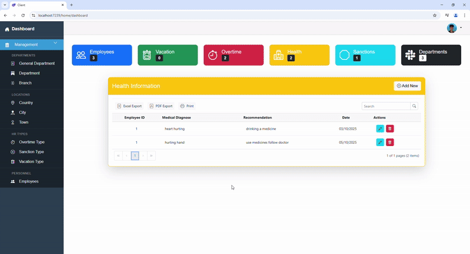

# Blazor WebAssembly Project

## Overview
This project is a Blazor WebAssembly application that includes various features such as user authentication, CRUD operations, and API integration. The project is built using .NET 8 and C# 12.0.

## Features
- User Authentication
- CRUD Operations
- API Integration
- Role Management
- Responsive UI

## Project Structure
The project is divided into several layers:
- **Client**: Contains the Blazor WebAssembly application.
- **Server**: Contains the ASP.NET Core Web API.
- **Shared**: Contains shared models and DTOs.

## Technologies Used
- Blazor WebAssembly
- ASP.NET Core Web API
- Entity Framework Core
- Syncfusion Blazor Components
- JWT Authentication

## Getting Started

### Prerequisites
- .NET 8 SDK
- Visual Studio 2022
- SQL Server

### Setup
1. Clone the repository:
2. Navigate to the Server directory:
3. Restore the dependencies:
- dotnet restore
4. Update the database:
- dotnet ef database update
5. Run Server First: 
- dotnet run
5. Run Client:
